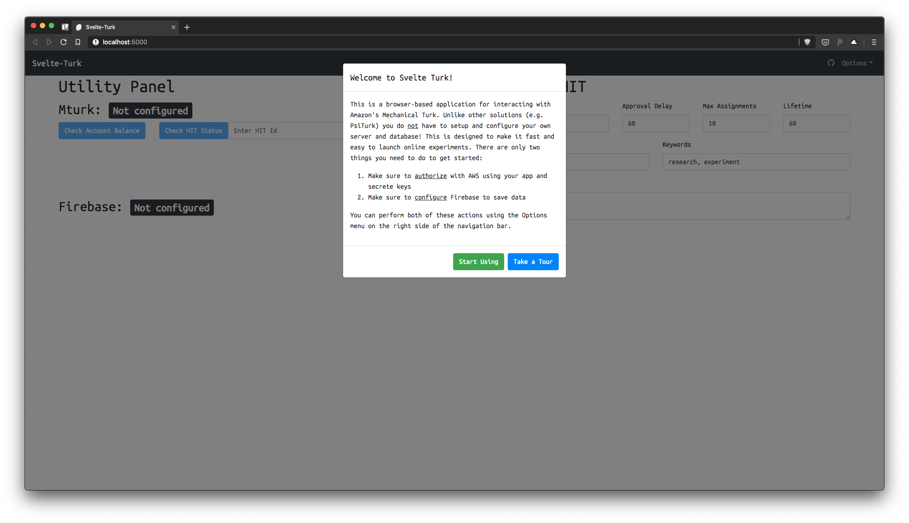
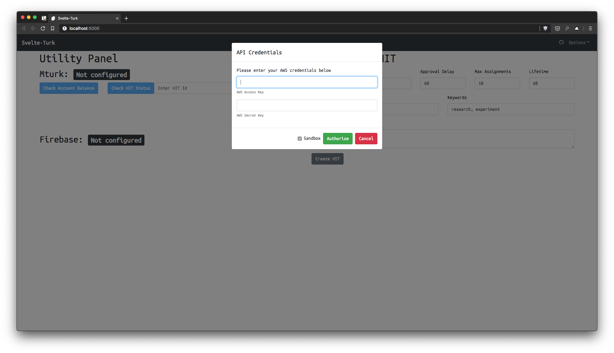
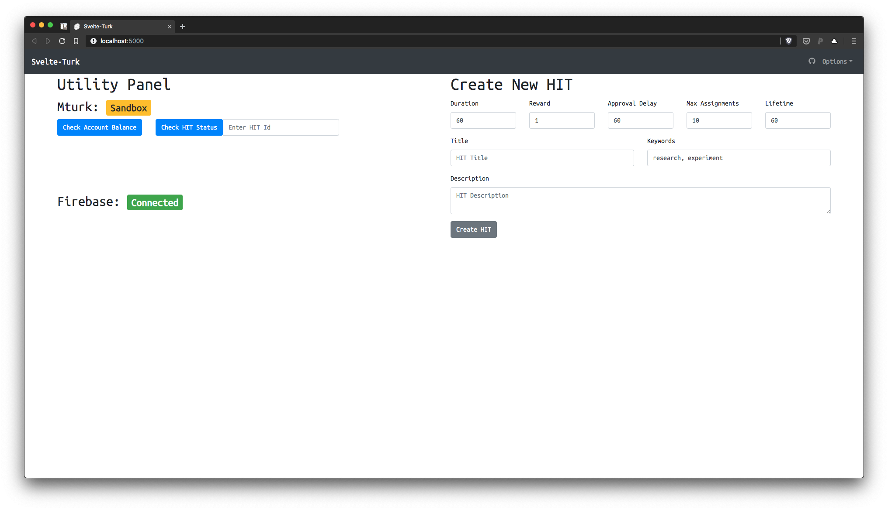
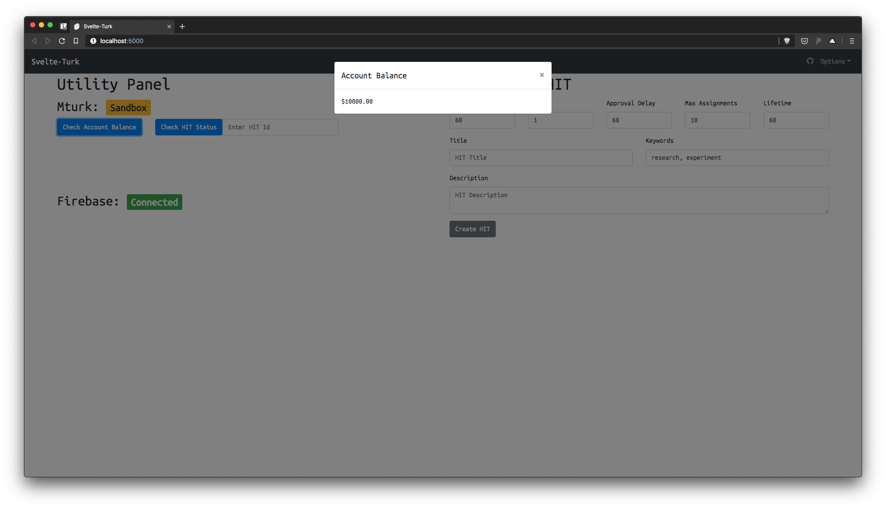

# Svelte-Turk

## 🚧 Work in Progress 🚧

## Assistance Welcome 💻

[Svelte](https://svelte.dev/) app for interacting with Amazon's Mechanical Turk and storing data in Firebase. Designed to be lightweight, offering a way to store data and interact with Mturk without all the complications of setting up a backend or database server. Hopefully this can grow into a viable simple alternative to something like [PsiTurk](https://psiturk.org/) + [JsPsych](https://www.jspsych.org/).  

- AWS has more-or-less unified their [APIs](https://docs.aws.amazon.com/AWSJavaScriptSDK/latest/) (including Mturk) and make much of their functionality available on the browser-side.   
- [Firebase](https://firebase.google.com/docs/reference/js) offers an easy way to read, write, and subscribe to a dynamic database from the browser alone.   
- [Netlify](https://www.netlify.com/) and similar providers like [Now](https://zeit.co/) and [Surge](https://surge.sh/) make it fast and easy to deploy and host a static web app.  
- Together these provide the bulk of the infrastructure needed to run modern web-applications without the need for server management  

This project is inspired by the server-less [JAMStack](https://jamstack.org/) architecture philosophy 

## Intended Usage

The project can provide a single static web-app that should be able to plug in to pretty much any other setup. That's because after a Svelte project is build, it produces just 3 files needed to run *everything*: `index.html`, `bundle.js`, and `bundle.css`. In theory you should be able to drop these files into any existing project (probably renaming `index.html` or something like `admin.html`) and then have a full adminstrative interface whenever you navigate to `youproject.com/admin`.

One way to try this out to is create a web-app/experiment with the [Svelte app project starter](https://github.com/ejolly/create-svelte-app) and then integrating it with svelte-turk.

## Developing

1. Install [npm](https://www.npmjs.com/get-npm) (if you don't have it)
2. Fork to your account on github
3. `git clone https://github.com/yourName/svelte-turk.git`  
4. `cd svelte-turk`
5. `npm install` 
6. `npm run dev` and navigate to `localhost:5000` in your browser

 ## Screenshots

 
 
 
 

## Notes

- Because there's no backend all application state is stored in the browser and a user will need to re-authorize if they refresh the page (there are ways around this e.g. saving state within firebase, but this is not currently implemented)

## Dependencies  

- Has no dependencies except for [SvelteStrap](https://bestguy.github.io/sveltestrap/?path=/story/introduction--get-started) for styling
- Loads in [Mturk Javascript API](https://docs.aws.amazon.com/AWSJavaScriptSDK/latest/) from a CDN
- Loads in [Firebase](https://firebase.google.com/docs/reference/js) from a CDN
- Loads in [Bootstrap CSS](https://getbootstrap.com/docs/4.3/getting-started/introduction/) from a CDN

